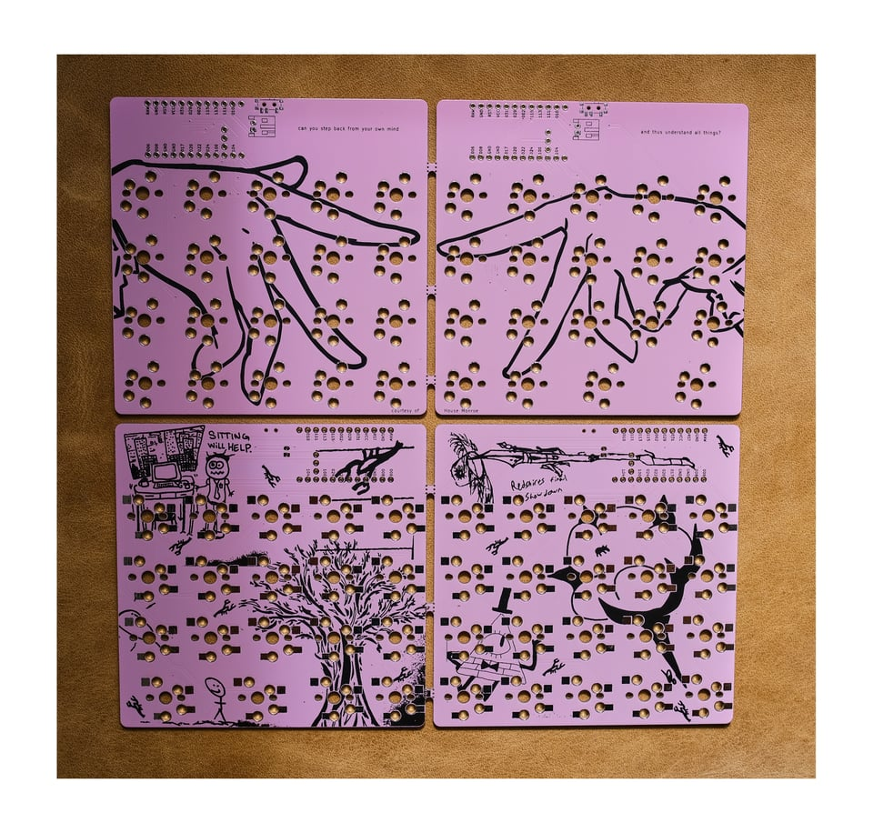

## Split38

This repo is a rough archive of the KiCad project for my Split38 keyboard.
ZMK firmware lives [here](https://github.com/JoeyDrew/zmk-config).

The Split38 is a symmetrical, wireless split keyboard with 38 keys designed around the Nice!Nano microcontroller running ZMK.
It is compatible with both Cherry MX and Choc-style switches, with or without hotswap sockets.
